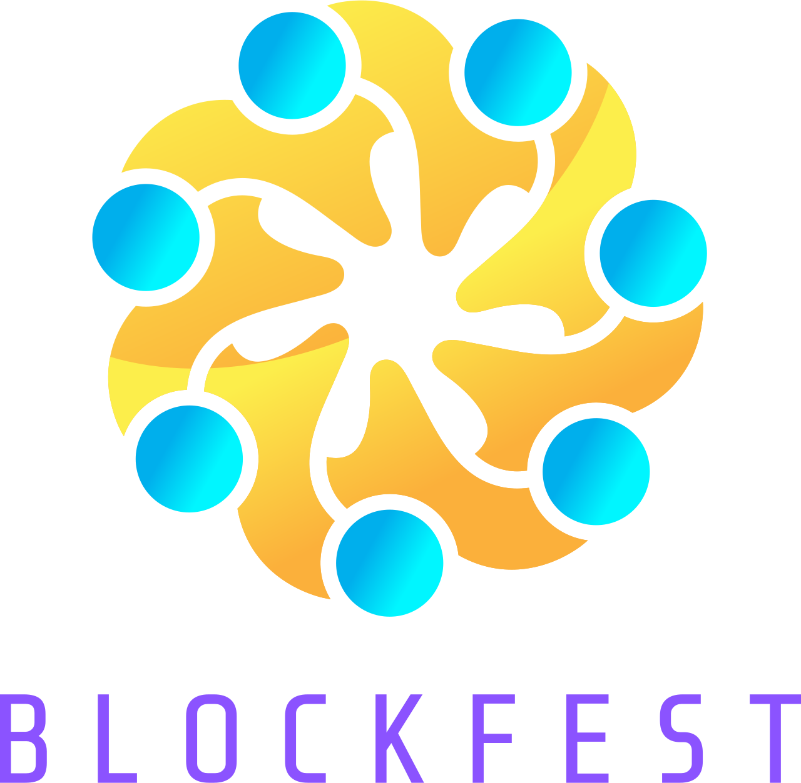

# BlockFest - Decentralized Event Ticketing on Stellar



## Project Overview 🌟

[Watch Demo Video](https://www.veed.io/view/d07dc722-db2d-4993-ba6d-28492323035c)

BlockFest is a decentralized event ticketing platform built on the Stellar blockchain. Our platform addresses the significant challenges in the traditional event ticketing industry, including ticket fraud, scalping, lack of transparency, and limited engagement between event organizers and attendees.

### Problem Statement

The event ticketing for blockchain-based events faces several challenges that traditional platforms do not adequately address:

1. **Limited Visibility**: Many blockchain events are poorly or narrowly marketed, remaining accessible only to closed groups or niche communities.
2. **Lack of Cryptocurrency Integration**: There are no robust platforms that allow for the purchase of tickets directly using cryptocurrencies, limiting access for crypto enthusiasts and reducing potential engagement.
3. **High Fees**: Centralized platforms charge substantial fees, which can be a significant burden for events operating within the blockchain ecosystem.

BlockFest leverages Stellar's fast, low-cost blockchain infrastructure to create a transparent, secure, and engaging ticketing ecosystem that benefits both event organizers and attendees. By issuing tickets as NFTs, we ensure each ticket's authenticity and offer a new way for attendees to interact with the event beyond just attendance.

## Features ✨

- **Decentralized NFT Ticketing**: Issue and manage event tickets as NFTs on the blockchain, providing a unique and verifiable proof of attendance.
- **Collection NFT Marketplace**: A dedicated marketplace for trading and showcasing event-related collection NFTs, enhancing visibility and engagement within the ecosystem.
- **User Profiles**: Manage user profiles with NFT collections and event history.
- **Web3 Event Creation**: Facilitate the creation of Web3 events on the platform, ensuring community engagement and secure ticket sales through Stellar's capabilities.

## Technical Architecture 🏗️

BlockFest is built using a comprehensive tech stack that leverages the power of the Stellar blockchain, ensuring seamless integration and functionality across both client and server sides:

### Technologies and Libraries

- **Next.js**: A React framework for building user interfaces, used for both rendering server-side pages and managing backend API routes.
- **Stellar SDK**: A JavaScript library that facilitates interaction with the Stellar network, used for creating and managing transactions and querying network data.
- **Stellar Wallets Kit**: Integrates with multiple Stellar wallets, including Freighter, Albedo, xBull, and WalletConnect, to provide users with secure and versatile wallet options.
- **IPFS/Pinata**: Utilized for decentralized storage of NFT metadata, ensuring data integrity and availability without reliance on centralized storage solutions.
- **Horizon**: The client-facing API server for the Stellar ecosystem, which allows interaction with the Stellar network to submit transactions, check account status, and subscribe to events.

### Architecture Overview

The architecture of BlockFest is designed to leverage these technologies to create a robust, scalable, and secure platform for decentralized event ticketing:

```
┌────────────────────────────────────────────────────────────────────────┐
│                                                                        │
│                                BlockFest                               │
│                                                                        │
│  ┌─────────────────────┐       ┌─────────────────────┐                 │
│  │     Frontend UI     │       │      Backend API     │                 │
│  │  (Next.js + React)  │       │     (Next.js API)    │                 │
│  └─────────────────────┘       └─────────────────────┘                 │
│           │                          │                                │
│           ▼                          ▼                                │
│  ┌─────────────────────┐       ┌─────────────────────┐                 │
│  │   Stellar Wallets   │       │     Stellar SDK     │                 │
│  │       Kit           │       │  & Horizon Server   │                 │
│  └─────────────────────┘       └─────────────────────┘                 │
│           │                          │                                │
│           ▼                          ▼                                │
│  ┌─────────────────────┐       ┌─────────────────────┐                 │
│  │   IPFS/Pinata for   │       │   Transaction and   │                 │
│  │   Metadata Storage  │       │   Data Management   │                 │
│  └─────────────────────┘       └─────────────────────┘                 │
│                                                                        │
└────────────────────────────────────────────────────────────────────────┘
```

## Implementation Details 💻

### NFT Ticket Issuance

BlockFest uses Stellar's native asset issuance capabilities to create NFT tickets:

1. **Ticket Creation**: When an organizer creates an event, the platform generates a unique asset code for each ticket type
2. **Metadata Storage**: Ticket details (event info, seat, etc.) are stored on IPFS via Pinata
3. **Asset Issuance**: A unique Stellar asset is created with the IPFS hash in the asset metadata
4. **Distribution**: When purchased, the NFT ticket is transferred to the buyer's Stellar wallet

```javascript
// Example of NFT ticket issuance
const issuerKeypair = Keypair.fromSecret(process.env.ISSUER_SECRET_KEY);
const nftAsset = new Asset("TBF", issuerKeypair.publicKey());

// Create transaction with payment operation (NFT transfer)
const transaction = new TransactionBuilder(issuerAccount, {
  fee: BASE_FEE,
  networkPassphrase: Networks.TESTNET,
})
  .addOperation(
    Operation.payment({
      destination: userPublicKey,
      asset: nftAsset,
      amount: "0.0000001", // Minimum amount for NFT
    })
  )
  .setTimeout(30)
  .build();
```

### Wallet Integration

BlockFest integrates with multiple Stellar wallets using the Stellar Wallets Kit:

```javascript
const kit = new StellarWalletsKit({
  network: WalletNetwork.TESTNET,
  selectedWalletId: XBULL_ID,
  modules: [
    new xBullModule(),
    new FreighterModule(),
    new AlbedoModule(),
    new LedgerModule(),
    new WalletConnectModule({
      projectId: process.env.WALLET_CONNECT_PROJECT_ID,
      // Other configuration...
    }),
  ],
});
```

### Transaction Signing Flow

The transaction signing and submission process involves several steps to ensure the secure minting and transfer of NFT tickets on the Stellar network:

1. **Backend Preparation**: The backend prepares the transaction, which includes several operations:

   - **Manage Data**: Adds NFT metadata to the issuer's account.
   - **Begin Sponsorship**: Starts sponsoring future reserves for the user.
   - **Create Trustline**: Establishes a trustline for the NFT asset, which is sponsored.
   - **End Sponsorship**: Ends the sponsorship of reserves.
   - **Send NFT**: Transfers the NFT to the user's account.

2. **Transaction Signing**:

   - The transaction is first signed by the issuer's keypair on the backend.
   - The transaction XDR (Transaction Descriptor Record) is then sent to the frontend.

3. **User Signature**:

   - The user signs the transaction using their wallet through the frontend interface, facilitated by the Stellar Wallets Kit.

4. **Submit to Stellar Network**:
   - The fully signed transaction is submitted to the Stellar network via Horizon.

```javascript
// Backend prepares and signs transaction
transaction.sign(issuerKeypair);
const transactionXDR = transaction.toXDR();

// Frontend gets user signature and submits
const { signedTxXdr } = await walletKit.signTransaction(transactionXDR, {
  networkPassphrase: Networks.TESTNET,
});

const server = new Server("https://horizon-testnet.stellar.org");
const result = await server.submitTransaction(
  TransactionBuilder.fromXDR(signedTxXdr, Networks.TESTNET)
);
```

## Technical Decisions and Justifications 🤔

### Why Stellar?

We chose Stellar for BlockFest for several key reasons:

1. **Low Transaction Costs**: Stellar's minimal fees (0.00001 XLM per operation) make it economically viable for ticketing
2. **Fast Finality**: Transactions confirm in 3-5 seconds, providing immediate ticket delivery
3. **Scalability**: Capable of handling 1000+ transactions per second, suitable for high-demand ticket sales
4. **Energy Efficiency**: Stellar's consensus protocol is environmentally friendly compared to proof-of-work blockchains
5. **Community Support**: Stellar has a strong and active developer community, providing extensive resources and support

### Why IPFS/Pinata for Metadata?

1. **Decentralization**: Ensures ticket metadata persists independently of our platform
2. **Content Addressing**: IPFS's content-based addressing ensures data integrity
3. **Pinata Service**: Provides reliable pinning to keep metadata accessible

## Team Experience with Stellar 👨‍💻

Our team is new to Stellar development:

- **Previous Projects**: This is our first project utilizing Stellar's capabilities.
- **Community Involvement**: We have participated in events sponsored by Stellar in Brazil in Florianópolis and are eager to engage more with the Stellar developer community and participate in future hackathons.

## Deployment and Testing Instructions 🚀

### Prerequisites

- Node.js (v18+)
- npm or yarn
- A Stellar wallet (Freighter, Albedo, xBull, etc.)
- Testnet XLM (available from [Stellar Laboratory](https://laboratory.stellar.org/))

### Environment Setup

1. Clone the repository:

```bash
git clone https://github.com/vivipolli/blockFest.git
cd blockFest
```

2. Install dependencies:

```bash
npm install
# or
yarn install
```

3. Configure environment variables:
   Create a `.env` file with the following variables:

```
# Pinata Configuration (for IPFS storage)
NEXT_PUBLIC_PINATA_API_KEY=
NEXT_PUBLIC_PINATA_SECRET_API_KEY=

# Stellar Soroban Configuration
NEXT_PUBLIC_SECRET_KEY=
NEXT_PUBLIC_NETWORK_PASSPHRASE="Test SDF Network ; September 2015"
NEXT_PUBLIC_SOROBAN_RPC_URL=https://soroban-testnet.stellar.org

# Wallet Connect Configuration
NEXT_PUBLIC_WALLET_CONNECT_PROJECT_ID=
```

### Running the Application

1. Start the development server:

```bash
npm run dev
# or
yarn dev
```

2. Open your browser and navigate to `http://localhost:3000`

### Testing the Application

1. Connect your Stellar wallet (Freighter recommended for testing)
2. Create an event (if you're an organizer)
3. Purchase a ticket using testnet XLM
4. View your NFT ticket in your wallet or on the platform

## Testing Credentials

For testing the platform, you can use these credentials:

- **Test Organizer Account**:

  - Public Key: `GCFDGPZTMYXGNLZU2JGNMJAV6NBZA2ATASY7ECUVD5HCPBILOLYTGSFY`
  - Secret Key: Available upon request for legitimate testing purposes

- **Test User Account**:
  - Create your own using Stellar Laboratory or any Stellar wallet

## Future Implementations 🚀

### Short-term Improvements

- **Enhanced UI/UX**: Improved interface design and user experience features
- **Centralized Database Integration**: Adding database support to store event details and user preferences
- **NFT Marketplace Integration**: Implementing a marketplace with contract functionality for collection NFT issuance
- **Social Login**: Adding the ability to log in with social media accounts
- **Follow Functionality**: Enabling users to follow event organizers and other attendees

### Long-term Vision

- **Decentralized Social Features**: Building a fully decentralized social layer for greater interaction between participants
- **Multi-chain Support**: Expanding beyond Stellar to support other blockchain networks
- **DAO Governance**: Implementing decentralized autonomous organization features for community-driven event management

## License 📄

BlockFest is licensed under the MIT License - see the [LICENSE](LICENSE) file for details.

## Storage Considerations

Currently, non-sensitive data such as NFT ticket information is stored in the browser's localStorage for quick access. This is a temporary solution, and future implementations will migrate this storage to a secure database to enhance data integrity and security.
